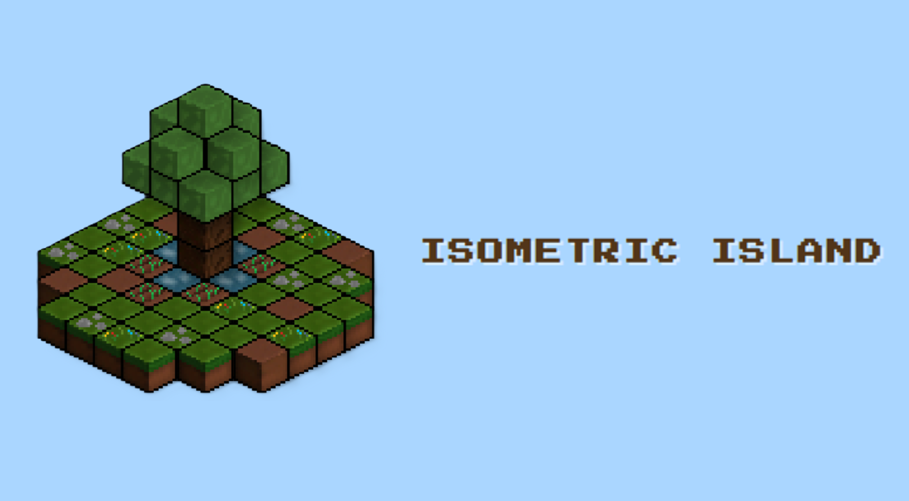
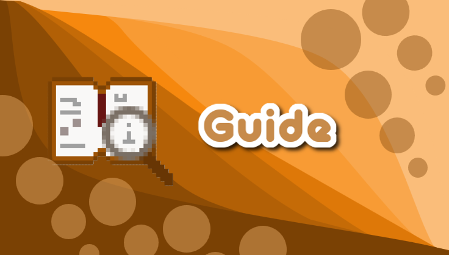
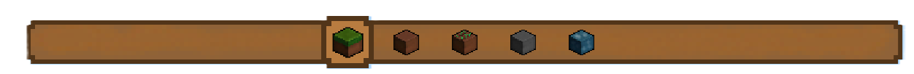
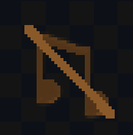
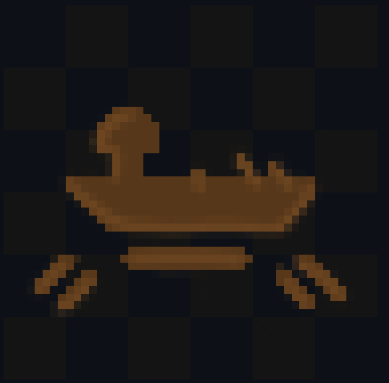

# Welcome to the Isometric Island Project!
Here you will find some relevant subjects and explanations about my game, including CREDITS, a quick guide, and much more!

# About Isometric Island
- This is a chill simulation of a mini island where you can customize it using the hotbar elements :)
- This "game" is made in HTML5 just to make sure anyone can play it on any browser from any device on this planet, even if you use Linux, Mac, or any other OS that uses a different method to run programs.

# Starter Guide

### This is the base guide for my project if you are new to this (your "How to use" manual).

### 1. Zoom Bar

- The Zoom bar is a convenient way to see your island smaller or bigger.
- To do that, you simply have to drag the square that is present in that bar or press the buttons next to the bar.

### 2. Hotbar or Blocks

- This is very useful if you want to change an existing block or add a new one.
- It contains every block available in the "game," drawn by me.
- To use a specific block, you have to hover your mouse over it and then click until you see the selector on the item you picked. 
- For multilayer blocks, see section 5.

### 3. Island and Block Placement

- In order to place blocks, you need to have selected the block you want (see section 2).
- After you do that, you have to point your cursor to the tile you want to change. You'll know the tile is targeted when the block brightness changes slightly (see red mark); after that, you just have to click and you're done. That easy!

### 4. Island Shaping 

- You can shape the island however you want thanks to the eraser tool from the hotbar, which is very helpful for different and cooler designs.

- To use it, you just have to select it from the hotbar like any regular item, then press a highlighted block with your cursor and it will fade away.
- To bring an empty block back, you just have to place another block from the hotbar there (for example, Dirt).
- Overall, very helpful!

### 5. MultiLayer Objects

- You can add multilayer objects from the hotbar. 
- A multilayer object is placed ON the platform, so it does not affect the platform structure.
- When erased, it is removed instantly.

### 6. Details & Shadows
- This game includes island and block shadows.
- Also, the trees sometimes drop leaves in 3 different styles

### 7. Background Music
- Background music is a way to bring realistic detail to the game, although some people may not like it.
- It can be disabled via the button next to the hotbar.

### 8. Island Float
- The island can float, giving it a very cool effect when enabled.

### Warning! 
- Do not try to use browser zoom because it can sometimes break the island canvas for unknown reasons.
- This is not a survival game or any kind of competitive game; it is made for relaxation and creative purposes only.
- This "game" is only playable on a computer/tablet. Playing on a phone may result in bugs that make the game unplayable.
- Do not copy my work and publish it without crediting my GitHub page. Thank you!

### (BETA) Meaning
- Even if a function works well for others, it can be defective in some ways.
- If a function is categorized as "BETA," you can expect bugs.
- Bugs are computer errors that occur because of broken code or missing features!

# Software that I used to make this project come true
- Here is the list of software I used to make this project:
1. PowerPoint: Thumbnails for the devlogs (crazy, I know!).
2. Pixilart: For the textures.
3. Visual Studio Code: For the project's HTML.
4. Audacity + TurboWarp sound editor: For the SFX effects (just random headphone mic sounds with a bunch of effects).

# Future functions
- You can see an unorganized list of functions and stuff that I want to add in `todo.md` here on GitHub.
- You can also suggest some features for my project on Flavortown.

# Credits
- Here you will find credits for stuff that I used from the internet:
1. Google Fonts: For the text font title. See `FontLicense.md` for the APACHE license and Terms and Conditions. You can learn more about the Apache license here: https://www.apache.org/licenses/LICENSE-2.0  
! Anything else you find in my project's Assets folder is purely made by me !
2. Minecraft tips inspiration: The game title contains nonsense tips inspired by Minecraft. 

### You reached the end for now :)
- You can try:
1. Check `todo.md`
2. Check assets
3. Star the repo
4. Suggest something cool (on Flavortown!)
5. Don't like it? It's okay! Give me some feedback on what I can improve.