# Welcome to the Isometric Island Project! 
Here you will find some relevant subjects and explanations about my game, including CREDITS, a quick guide, and much more!

# About Isometric Island
- This is a chill simulation of a mini island where you can customize it using the hotbar elements :)
- This "game" is made in HTML5 just to make sure anyone can play it on any browser from any device on this planet, even if you use Linux, Mac, or any other OS that uses a different method to run programs.

# Supported Devices!
- Some PCs can run the game but require low zoom. To do this, you need to go into your browser settings.
- The lowest supported PC resolution acceptable is 800x600 33% Zoom
- Not compatible with phone devices
- Tablets compatibility: 16:9 67% zoom (SM Tab 9 Shoot)

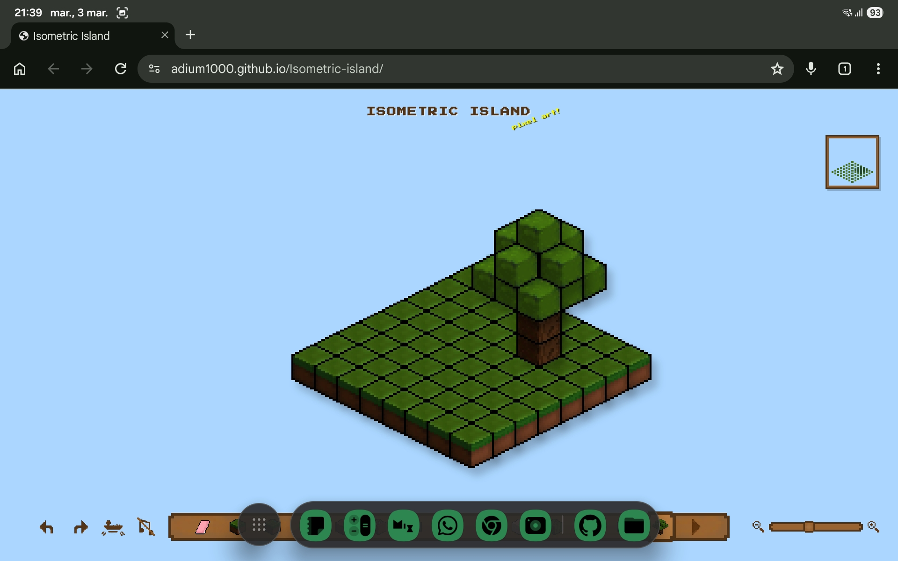

### - Play it now: https://adium1000.github.io/Isometric-island/
# Starter Guide

### This is the base guide for my project if you are new to this (your "How to use" manual).

- The Zoom bar is a convenient way to see your island smaller or bigger.
- To do that, you simply have to drag the square that is present in that bar or press the buttons next to the bar.

- This is very useful if you want to change an existing block or add a new one.
- The hotbar contains 2 pages; if you want to access the second page, you have to click on the arrow icon.
- It contains every block available in the "game," drawn by me.
- To use a specific block, you have to hover your mouse over it and then click until you see the selector on the item you picked.
- For multilayer blocks, see section 5.

- In order to place blocks, you need to have selected the block you want (see section 2).
- After you do that, you have to point your cursor to the tile you want to change. You'll know the tile is targeted when the block brightness changes slightly (see red mark); after that, you just have to click and you're done. That easy!

 

- You can shape the island however you want thanks to the eraser tool from the hotbar, which is very helpful for different and cooler designs.

- To use it, you just have to select it from the hotbar like any regular item, then press a highlighted block with your cursor and it will fade away.
- To bring an empty block back, you just have to place another block from the hotbar there (for example, Dirt).
- Overall, very helpful!

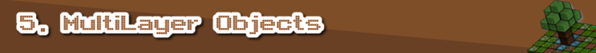

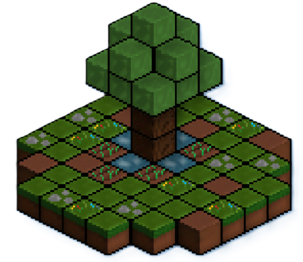
- You can add multilayer objects from the hotbar.
- A multilayer object is placed ON the platform, so it does not affect the platform structure.
- When erased, it is removed instantly.

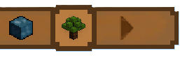

- This game includes island and block shadows.
- Also, the trees sometimes drop leaves in 3 different styles.

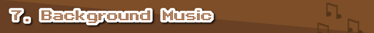

- Background music is a way to bring realistic detail to the game.
- Or if you don't like background music, just listen to some Spotify chill music :D

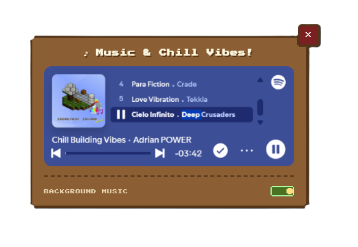

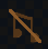

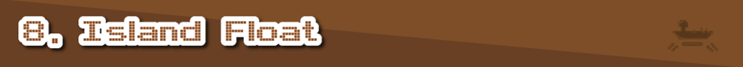

- The island can float, giving it a very cool effect when enabled.
- Also, you can set different modes for this.
- You can also change the speed using the seekbar

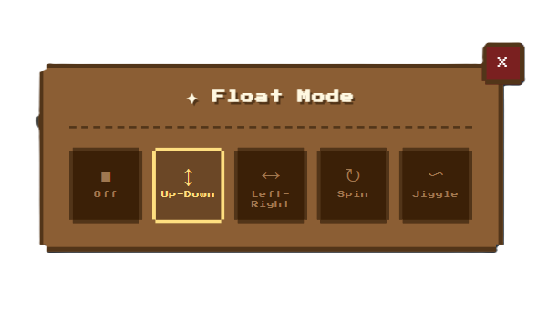

- The 'game' can use OS/OWN cursors; check settings.
- For example, if you hover, click, or interact with specific buttons (Middle click to move the island, Touching Background, Touching Hotbar, etc.)
- Middle click to move the island.

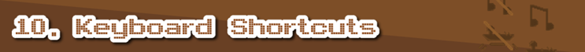

- The 'game' can be controlled by any input device like a keyboard, Macropad, or Keypad.
- Here is the list of keyboard shortcuts:

|Key       | Action                         |
|:--------:|:------------------------------:|
| E        | Quick-select Eraser            |
| P        | Toggle between Hotbar Pages    |
| M        | Toggle Music                   |
| F        | Toggle Island Float mode       |
| CTRL + Z | Undo                           |
| CTRL + Y | Redo                           |
| ALT + Click on Block | Eyedropper|

- Minimap is a small overall sketch of your island helping the user when using the pan tool or zoom.
- Clicking on the minimap zooms the island to see it better.

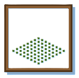

- Undo and Redo functions are like a time machine: for example, if you make a mistake, you can turn back time to a point where the mistake did not exist, or if you still don't like it, you can return to the present.

- File menu is a typical menu with actions for your island like: SAVE, LOAD, DELETE, RANDOM ISLAND using the same accent colors as the hotbar.

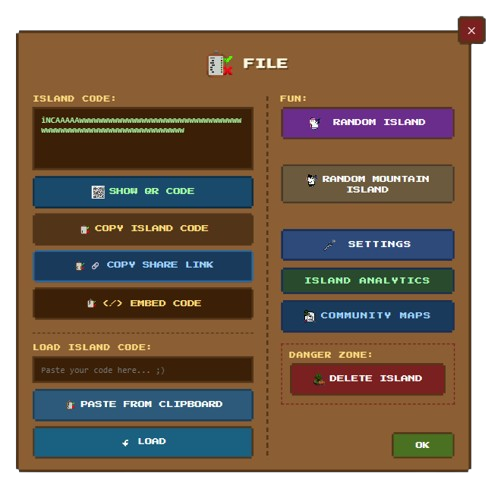

1. Island Code
- This is a save code for your island; copy it and keep it safe :3
2. Load Island Code
- Here you paste the code you saved from (1.)
3. Danger zone/Delete island
- From here you can clear the island and start over.
4. Settings
- Configuration tool for your island.
5. Fun

- Generate random islands.
- Island as an emoji 

6. Community maps
- Publish a great map.
RULES
- Do not replicate EXPLICIT content (when you log in, I have access to your username and Gmail, so it would be a shame to do that).
- Do not make bad maps or empty maps.

Community explorer

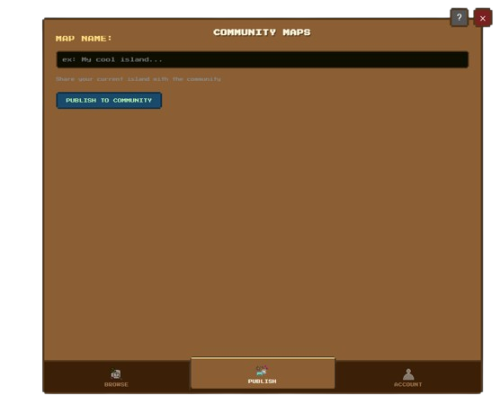

Map publisher

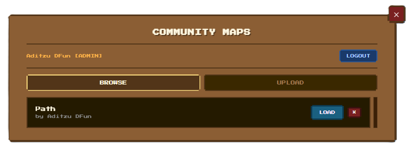

7. Embed Map
- Do you want to show off your map on a website? , we got u!
- Just Implement it in an IFRAME :D

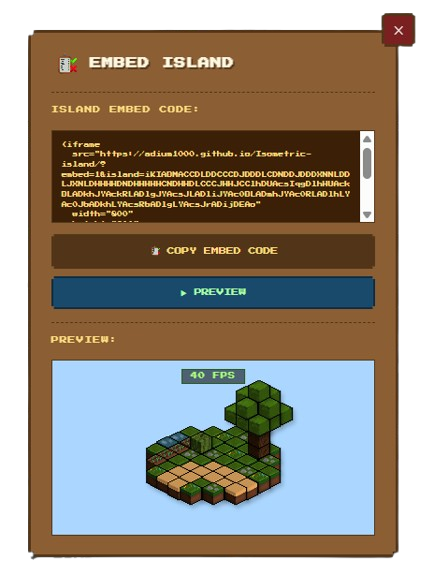

8. Island Analytics
- this option lets you see how manny blocks you used building your island

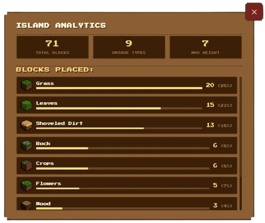

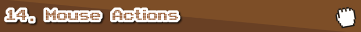

- You can perform more actions with your mouse such as Grabbing island / Select specific Blocks / or the simple block change.

9. Island save slots
- contains a menu with saved islands with a maximum of 3 slots :3

|Mouse Key    | Action                               |
|:-----------:|:------------------------------------:|
| Left Click  | Place Blocks                         |
| Right Click | Select island specific blocks/fill  /Radial |
| Middle Click| Pan tool/Grabbing                    |

- Let's break each action down to make it easier to understand.

1. Left click - It lets you place or modify island blocks with the hotbar selected item.

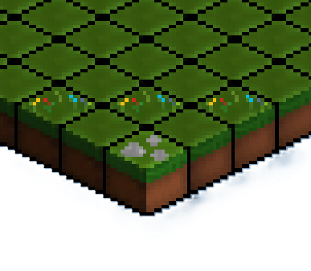

2. Right click - Imagine the island is your desktop; when you drag with left click and select on your desktop you can delete or copy. That is almost the same here  you can select using `RIGHT` click or `CTRL + LEFT CLICK`.

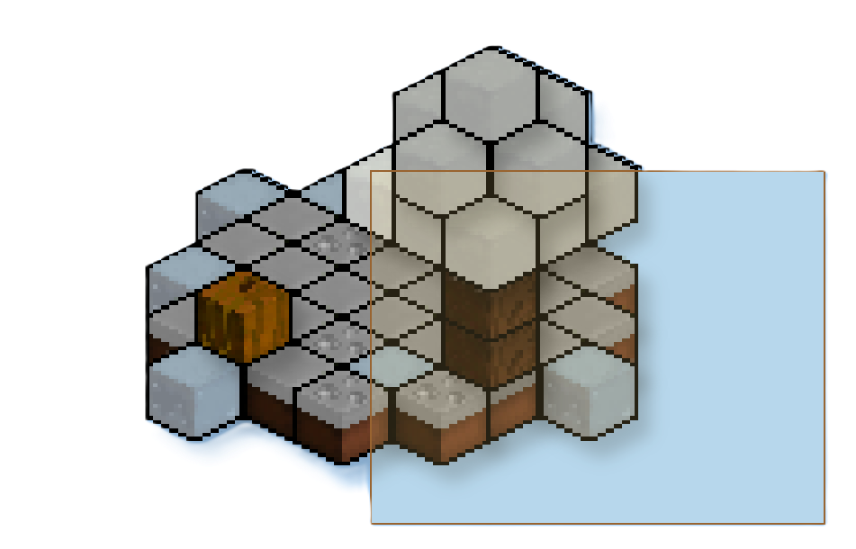

3. Middle click - Here is the pan tool / dragging tool. When you don't have space on the screen you can drag your island where you want to design it.

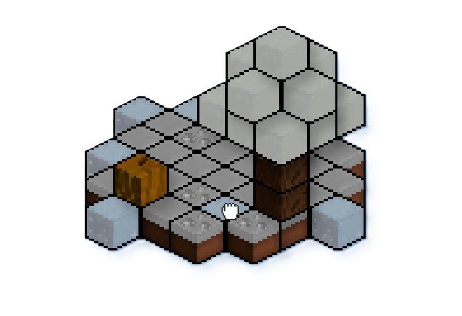

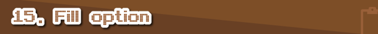

- This function lets you fill a selected area of blocks with Right Click or CTRL + Left Click.
- After a number of blocks is selected, a button will appear at the bottom of the island.

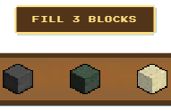

- After you click on the button, this popup will open.

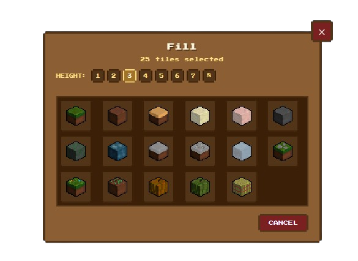

- From here you can choose the block you want to fill your area and choose how much to fill on the Y axis very helpful for creating mountains and cool stuff.

- Toasts are like small bits of information/confirmation of actions.
- This project uses toasts to show an action that has been completed successfully.

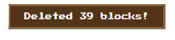

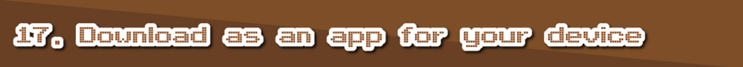
 
1. Chrome PWA application (Recommended!)

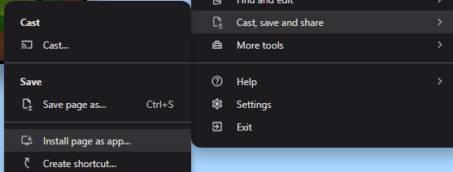

- For Chrome, go to the 3 dots in the top-right corner -> Cast, save & share -> Install page as an app.

- Or simply click this button.

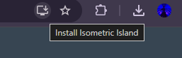

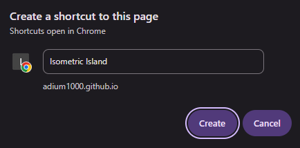

- Press Create.

2. Android APK Build for tablets (BETA)

- Please note that this is a beta version and may not work on some tablets/Android devices!
- First, download the APK from releases.

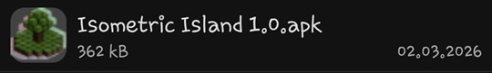

- Click on the file and choose package installer.

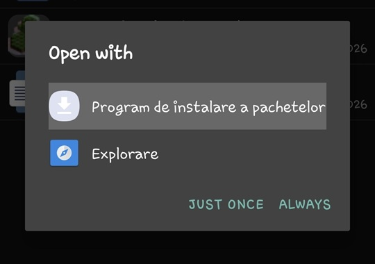

- Click on Install.

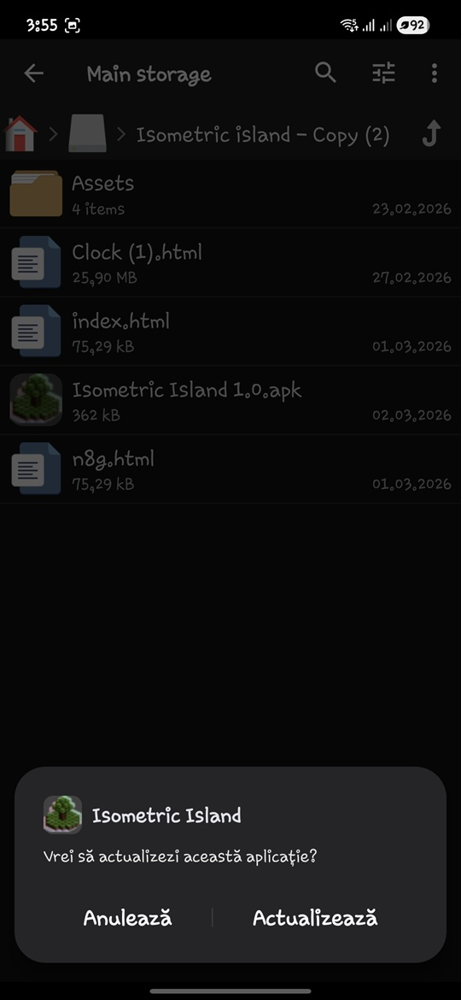

- If Play Protect pops up, click on More options -> Install without verification.

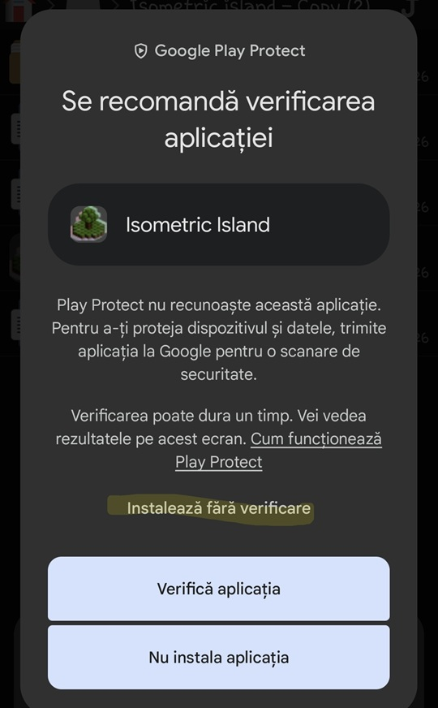

And done!

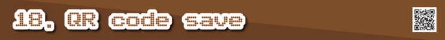

- You can share small islands by QR codes via File menu -> QR code button.

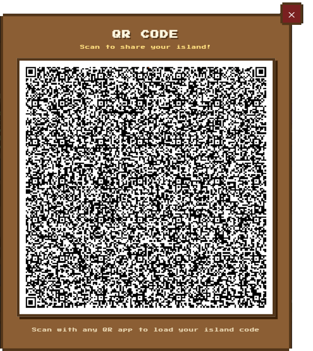

- Then you can scan it using your phone and keep it safe :3

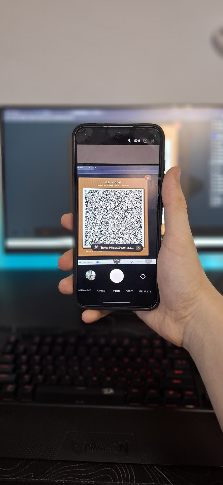

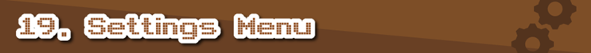

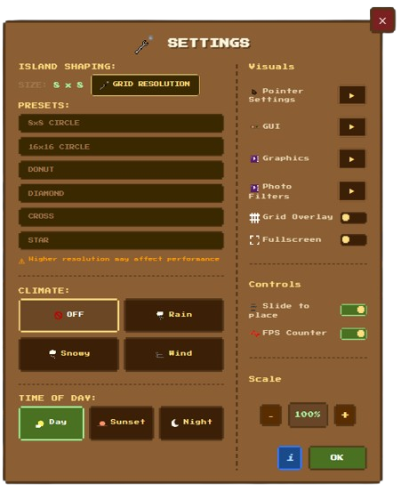

- Settings menu contains island configuration tools like:
1. Island shaping
- This "tool" lets you format your island with a resolution up to 8x8 by just touching a square with the mouse.
2. Random Island
- This button generates a random seed island: Stone/Snow/Desert/Summer/Ocean.
3. Climate
- This option lets you change the climate for better visuals for your island style :3
4. Time of the day
- This option lets you change the time in the game.
5. Visuals Menu
- Contains a list of toggles for appearance and debugging.
6. Controls
- Contains a list of toggles for better options.
7. Scale
- Helpful to make the game use all the screen :3
8. Mouse options
- Helpful settings for the mouse.
9. GUI colors
- Customize the GUI :3
10. Key binds
- Change the key-shortcuts

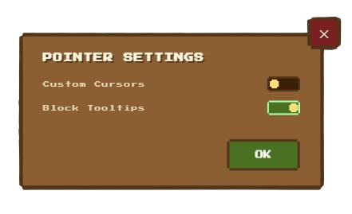

9. Visual or Graphic settings
- Includes a bunch of sliders for shadows and more.

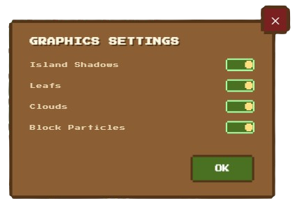

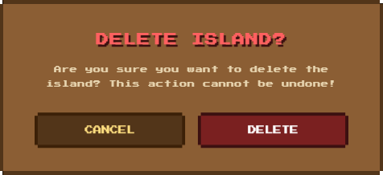

- This menu makes sure you don't accidentally press the delete island button :)

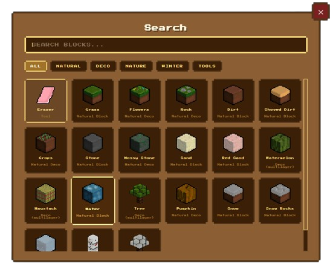

- Search menu is a menu where you can easily search for blocks by name or by scrolling.

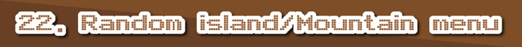

 - This menu lets you choose how the randomly generated island will look like.
 
 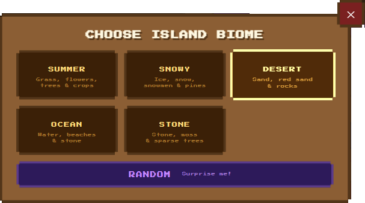

 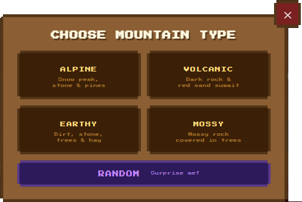

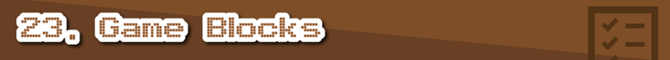

- Here is a list of the game blocks and their categories.

| Block                                     | Category                       |     
|:-----------------------------------------:|:------------------------------:|
| 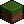           | Natural                        |      
| 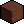         | Natural                        |  
| 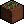         | Natural Decoration             |  
| 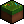     | Natural Decoration             | 
| 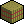             | Natural Decoration             | 
|              | Snowy Decoration               | 
|          | Natural                        |  
|     | Natural                        |  
|      | Natural Decoration             | 
|      | Natural                        |  
|           | Natural                        |   
|            | Natural                        |   
|    | Natural Decoration             |  
|            | Snowy Decoration               | 
|          | Snowy Decoration               | 
|  | Snowy Decoration               | 
|          | Natural                        |   
|          | Natural Decoration             |  
|          | Natural                        |   
|   | Snowy Decoration               | 

- Radial menu is a shortcut manager for some commands like brush size, grid, mirror

- Mirror popup contains options for mirroring the brush

- Brush settings contains options about the brush tickness

Achivements are a fun way to discover new things about this game :3
You can acces it via the file menu

### Warning!

- This is not a survival game or any kind of competitive game; it is made for relaxation and creative purposes only.
- This "game" is only playable on a computer/tablet. Playing on a phone may result in bugs that make the game unplayable.
- Do not copy my work and publish it without crediting my GitHub page. Thank you!

### Issues

- Sometimes zoom can break the island canvas for unknown reasons.

### (BETA) Meaning

- Even if a function works well for others, it can be defective in some ways.
- If a function is categorized as "BETA," you can expect bugs.
- Bugs are computer errors that occur because of broken code or missing features!

# Software that I used to make this project come true

- Here is the list of software I used to make this project:

| Nr. Crt  | Software                       | Where I used it?                      |  
|:--------:|:------------------------------:|:-------------------------------------:|
| 1.       | Microsoft Office: PowerPoint   | Used for Devlogs and Banners          |
| 2.       | Pixlart                        | Used for early game assets            |
| 3.       | Paint.NET                      | Used for designing pixel art          | 
| 4.       | Audacity                       | Used for SFX                          |
| 5.       | Turbowarp sound editor         | Used for SFX speedups                 |
| 6.       | Visual Studio Code IDE         | Used for pushing my repo and code     |

# Future functions

- You can see an unorganized list of functions and stuff that I want to add in `todo.md` here on GitHub.
- You can also suggest some features for my project on Flavortown.

# History of this game
- The idea for Isometric Island started on 07.06.22 when the first version of Isometric Island was released by me on Scratch  that website that traumatized me until 8th grade or so. I kept it updated until 2024 when I gave up because it was so bad.

- Almost 2 years later I remembered about that idea and I said "I need to remake it in HTML, but in an isometric style." That is how Isometric Island was born with a pretty interesting history.

# Credits

- Here you will find credits for stuff that I used from the internet:
1. Google Fonts: For the text font title. See `FontLicense.md` for the APACHE license and Terms and Conditions. You can learn more about the Apache license here: https://www.apache.org/licenses/LICENSE-2.0  
2. Minecraft tips inspiration: The game title contains nonsense tips inspired by Minecraft. 

3. Some Devlogs and Banners use Maagkramp by ficod. This font is used under its Personal Use License! Check out his DeviantArt profile: https://www.deviantart.com/ficod
 - PLEASE NOTE THAT THE PROJECT DOES NOT USE THIS FONT!!

4. AI
- This project uses ai for debugging and adding small tools/futures!

THE README IS FULLY WRITEN BY ME - a wiki for my game kinda

# ! Anything else you find in my project's Assets folder is purely made by me !

# Optimization

1. Service Worker (sw.js). This is a file that catches all the requests the browser makes to the network. The first time you visit, it saves important things like the hotbar, blocks, and audio in a special place so they load fast. The next time you visit, it gets these things from that special place on your computer instead of asking the server for them.

2. In-Memory Image Cache (_imgCache). This is like a map that remembers pictures that have already been loaded. If you use a block a few times, it does not have to decode the picture again  it just uses the one it already has in memory.

3. Lazy Audio Loading. Before, the game would load all the files at the same time when it started, which could slow things down. Now it only loads the hotbar sound right away. It loads sounds like the place sound and background music only when they are needed for the first time.

### You reached the end for now :)
   
- You can try:
1. Check `todo.md`
2. Check assets
3. Star the repo
4. Suggest something cool (on Flavortown!) see `FlavortownDevlogsHistory.md`
5. Don't like it? It's okay! Give me some feedback on what I can improve. :)
